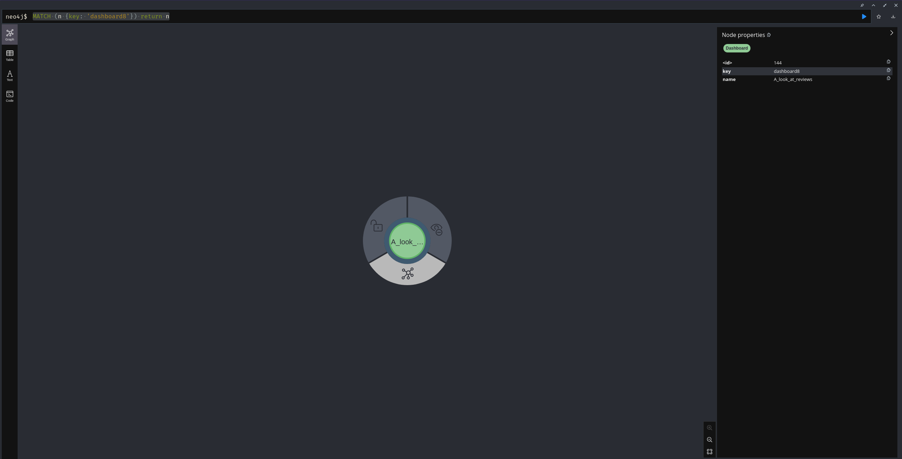
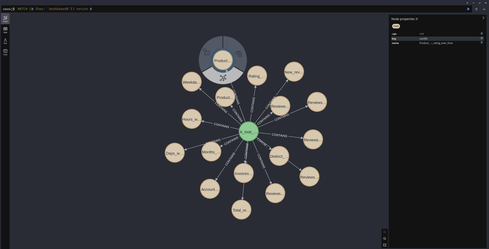

# MetaGraph

An admin's tool to get quick information about your instance entities like databases, fields, collections, cards and dashboards


## How to run

1) install Python
2) install dependencies with pip3 install -r metagraph/requirements.txt
3) configure the environment variables: user & password, or session_cookie in case you use sso, and host
4) run python metagraph/main.py cypher

You'll get a metagraph.cypher file that you can enter in a Neo4j database to visualize the dependencies

## Questions

### Why Neo4j

A graph database will allow you to do impact analyses like: "what happens if I delete a certain card?" or "which cards are connected to a dashboard?"

### I have SSO enabled, I can't use a simple user/pass authentication

Simply enter the session token as an environment variable and run the program as:

```
session_token=xxxxx python main.py cypher
```

### I want to know the fields of each table

Simply pass the --fields argument to the script. I added this but it's not being used at all, for now

## How to visualize a node chart in Neo4j

```
Match (n)-[r]->(m) Return n,r,m;
```

## How do I run a Neo4j database locally

Simply do 

```
docker run --rm -it -p 7474:7474 -p 7687:7687 -e NEO4J_AUTH=none neo4j:5.12.0
```

and go to localhost:7474 (no authentication)

NOTE: if you run `python metagraph/main.py neo4j` the script will connect to the neo4j database and insert the nodes automatically. No need to copy and paste the cypher

## How do I track dependencies?

After you populated the neo4j db, you can run queries like:

`MATCH (n {key: 'dashboard8'}) return n`

(dashboard8 is dashboard with the ID of 8 inside Metabase, so change it to anything you want here: table, card, collection)

...and you'll get the single node you're looking for. From there you can start navigating the graph to see the dependencies






# To do
- Dockerize this
- Add tests
- Probably many refactors